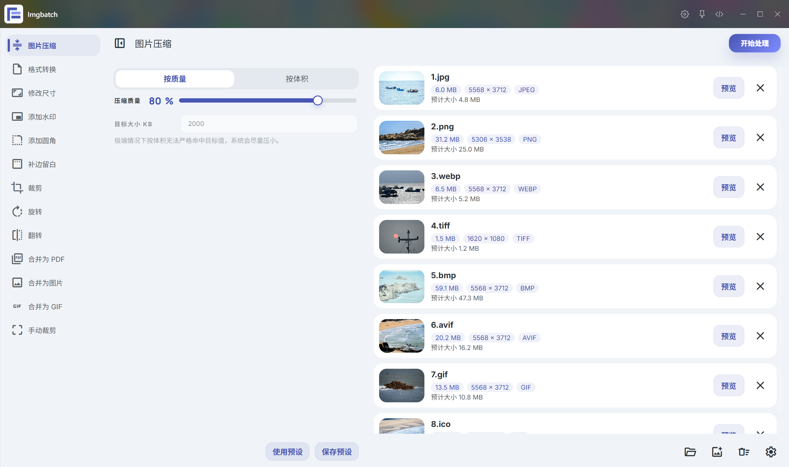
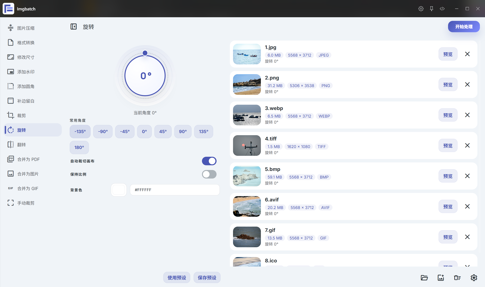
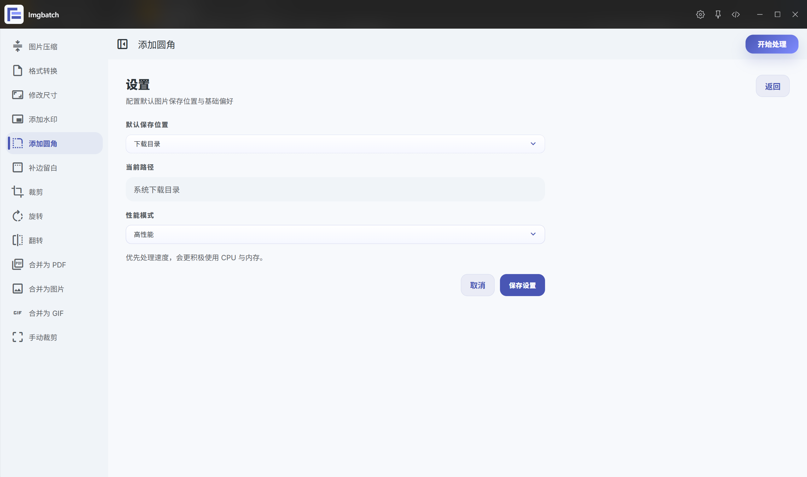
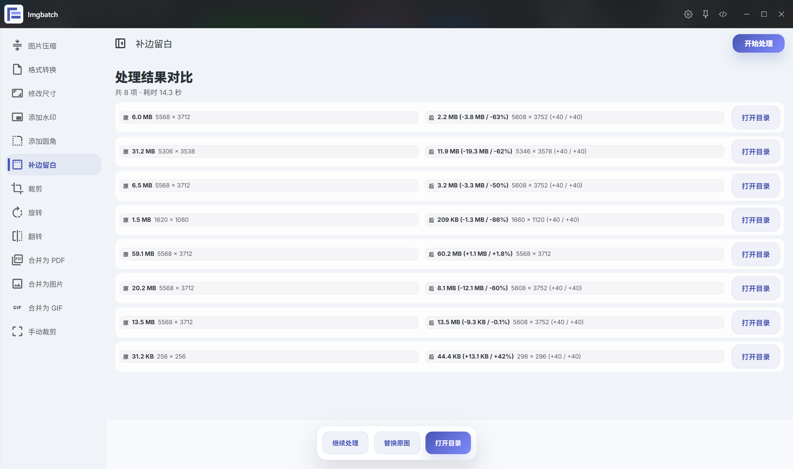

# Imgbatch

Imgbatch 是一个面向 ZTools 的图片批量处理插件，提供本地离线的多种图片处理能力，适合快速处理一批图片并统一输出结果。

当前版本：`0.1.0`

## 界面预览

### 图片压缩



### 格式转换


### 修改尺寸


### 添加水印


### 添加圆角


### 补边留白


### 裁剪


### 旋转



### 翻转


### 合并为 PDF


### 合并为图片


### 合并为 GIF


### 手动裁剪


### 预览效果


### 设置页



### 处理结果对比



## 功能

- 图片压缩
- 格式转换
- 修改尺寸
- 添加水印
- 添加圆角
- 补边留白
- 裁剪
- 旋转
- 翻转
- 合并为 PDF
- 合并为图片
- 合并为 GIF
- 手动裁剪

## 手动裁剪特性

- 每张图片独立保存旋转、翻转、缩放、平移和裁剪框状态
- 支持滚轮缩放图片、右键拖动图片
- 支持方向键微调裁剪框
- 支持边缘吸附和吸附强度切换
- 支持自由拖动和固定比例四角拖动切换
- 支持连续处理整批图片，并在完成后汇总显示结果

## 支持的图片格式

导入触发和常规处理当前支持这些输入格式：

- `jpg`
- `jpeg`
- `png`
- `webp`
- `gif`
- `bmp`
- `tif`
- `tiff`
- `avif`
- `heic`
- `heif`

其中，列表缩略图、预览以及部分合并流程已经补齐了 `tiff`、`avif`、`bmp`、`ico` 等兼容处理。

## 运行环境

- ZTools
- Node.js `>= 16`

本插件依赖本地 Node 能力，核心依赖包括：

- `sharp`
- `pdf-lib`
- `gifenc`

## 项目结构

```text
Imgbatch/
├── assets/         # 前端页面、状态、样式与组件
├── lib/            # preload 侧共享运行逻辑
├── index.html      # 插件页面入口
├── plugin.json     # ZTools 插件配置
├── preload.js      # 本地处理与 ZTools API 桥接
├── package.json    # 依赖配置
└── logo.png        # 插件图标
```

## 开发

安装依赖：

```bash
npm install
```

开发模式下，让 ZTools 读取当前开发目录即可。

## 打包测试

当前仓库内已经准备了一份可直接用于打包测试的目录：

`F:\Imgbatch\.release-test\imgbatch-0.1.0`

这个目录包含插件运行所需的入口文件、资源文件和依赖目录，可直接用于本地打包验证。

## 仓库

- 作者：`readerc`
- GitHub：[ReaderC/Imgbatch](https://github.com/ReaderC/Imgbatch)
